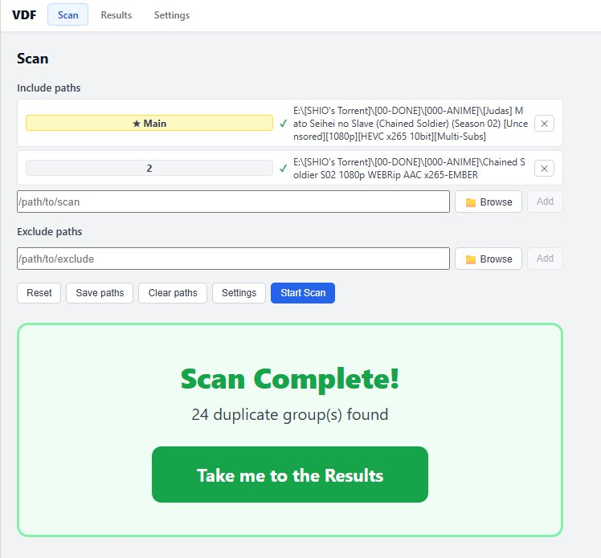
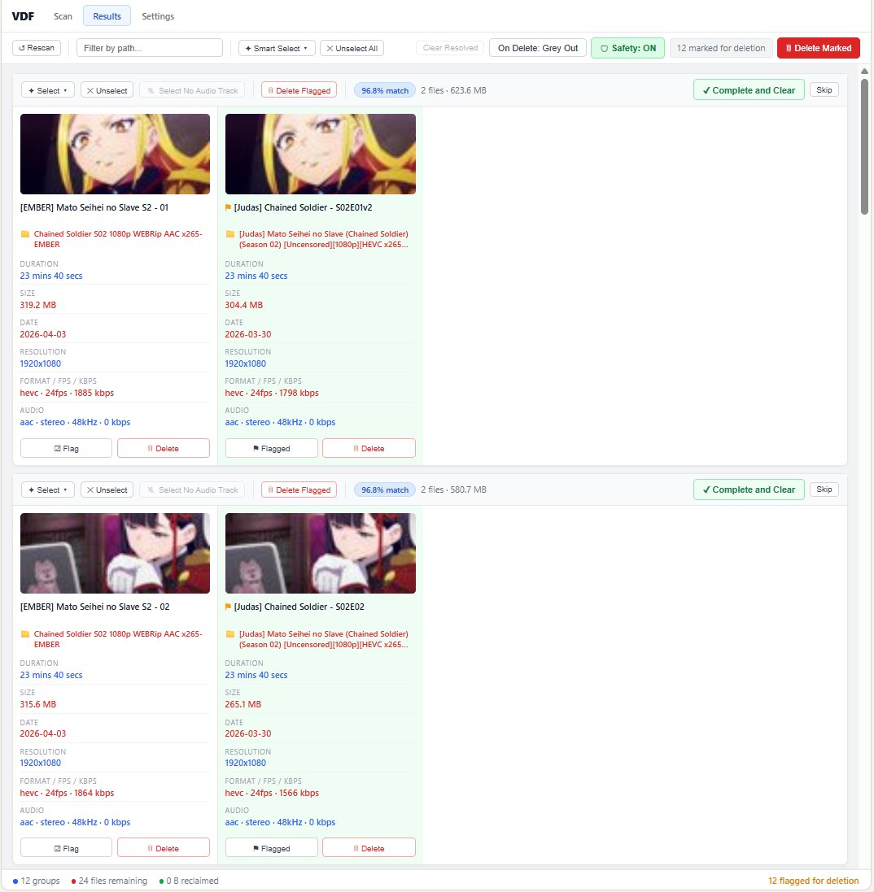

# video-dupe-finder-ui-mod

A fork of [videoduplicatefinder](https://github.com/0x90d/videoduplicatefinder) that extends the Web UI with additional review and workflow features, built for personal use on Windows.

The upstream already has a solid card-based Web UI with side-by-side comparison, dark/light themes, and auto-select. This fork builds on top of that with color-coded metadata, per-group controls, safety mode, and more granular selection tools to speed up the review process for larger libraries.

The core engine (VDF.Core) is unchanged — all scanning, hashing, and perceptual comparison logic is inherited from upstream. Only the web frontend has been modified.

---

## What This Fork Adds

| Feature | Description |
|---|---|
| Color-coded metadata (extended) | Upstream highlights matching values in green; this fork assigns distinct colors per unique value (blue, purple, amber for shared, red for unique) so you can see which files match each other in groups of 3+ |
| Configurable main folder | First folder gets ★ badge, its files always appear leftmost in every group |
| Per-group controls | Select, delete, complete & clear individual groups without touching the rest |
| Smart Select (expanded) | Shortest/longest duration, no audio track (skips all-silent groups) |
| Safety mode | Toggleable guard requiring confirmation before bulk deletions |
| Per-section settings | Save and reset-to-defaults buttons on each settings section |
| Scan complete banner | Prominent banner with result count and big button to view results |

---

## Screenshots

---

## Features

### Color coding tells you what matters before you even read it

Every metadata value is colored based on whether it matches across the group:

- **Blue / Purple / Amber** — values shared by two or more files
- **Red** — values unique to that file (where the files differ)

Duration, file size, resolution, format, FPS, bitrate, audio — all color-coded independently. Red values draw your eye to the differences immediately.

### Consistent left-right layout across every group

Designate a **Main folder** — the first folder you add gets a ★ badge. Its file always appears as the leftmost column in every card, every time. Combined with alphabetical sort by the main folder's filename, the results page reads like a sorted list you already know.

### Smart Select

Auto-flag files by criteria, per group or globally — all modes clear the previous selection before applying so you never accidentally stack selections.

**Global (toolbar dropdown):**
- Lowest quality (multi-criteria: duration → resolution → bitrate → fps → audio bitrate)
- Smallest file / Oldest / Newest
- Shortest duration / Longest duration
- 100% equal groups — flags all but one in perfectly identical groups
- **No audio track** — flags every video that has no audio stream; skips groups where all files lack audio
- Invert selection / Deselect all

**Per group (each card header):**
- Lowest / Highest resolution
- Smallest / Largest file
- Shortest / Longest duration
- **No audio track** — flags the file in that group with no audio stream; does nothing if every file in the group lacks audio (no good copy to compare against)

### Scan page

- **Save paths / Clear paths** — save your include and exclude folders to disk, or clear them all in one click
- **Settings shortcut** — quick link to Settings page right from the Scan tab
- **Scan complete banner** — large, prominent banner showing how many duplicate groups were found with a big "Take me to the Results" button

### Settings page

- **Per-section Save and Default Values** — Similarity, Scanning, and FFmpeg sections each have their own Save Settings and Default Values buttons
- Default Values resets only that section's fields back to factory defaults — you still need to click Save Settings to persist the change

### Deletion controls

- **On Delete: Grey Out** — deleted columns stay visible at 50% opacity with a ✕ overlay so you can see what was removed before moving on
- **On Delete: Remove** — columns disappear immediately
- All deletions go to the **Recycle Bin** — nothing permanently deleted; restore from Windows Recycle Bin if needed
- **Safety mode** — bulk deletions require confirmation by default; toggle off for Raw Mode

### Workflow tools

- **Rescan** button — re-run the scan with the same folders without going back to the Scan tab
- **Clear Resolved** — removes groups where all but one file has been deleted (no more clutter)
- **Complete and Clear** — dismiss a resolved group without deleting anything
- **Skip** — same as Complete and Clear
- **Beep on scan complete** — plays a tone when a scan finishes (toggle in Settings)

### Everything else

- **Folder browser** — pick folders by clicking through drives and directories instead of pasting paths
- **Filter by path** — live search to narrow results to folders you care about
- **Deleted columns stay visible** — greyed out with overlay so context isn't lost
- **FFmpeg auto-download** — downloads FFmpeg automatically on first launch; no manual setup required
- **Status bar** — group count, remaining files, reclaimed space, flagged count

---

## Installing & Using

No technical knowledge required. You just need a Windows PC.

### Step 1 — Download

Go to the [Releases page](../../releases) and download the `.zip` file under the latest release. Save it anywhere — your Desktop is fine.

### Step 2 — Extract

Right-click the zip file → **Extract All** → click **Extract**.

> Do not try to run anything from inside the zip. Extract it first.

### Step 3 — Launch

Open the extracted folder and double-click **`Start VDF.bat`**.

**If Windows shows "Windows protected your PC":** click **More info** → **Run anyway**. This happens because the app isn't published through the Microsoft Store. It's safe.

A small black window will appear minimised in your taskbar — that's the server running. Leave it open. Your browser will open automatically in a few seconds.

### Step 4 — First launch: FFmpeg download

The first time you run the app, it needs to download FFmpeg (the tool it uses to read video files). You'll see a progress bar on the Scan page — this takes about 1–2 minutes and uses roughly 60–80 MB. It only happens once. Wait for it to finish before scanning.

---

### Scanning for duplicates

1. On the **Scan** tab, click **Browse** and select a folder to scan. You can add multiple folders.
   - The first folder you add becomes the **Main folder** — its files always appear on the left in results.
2. Click **Start Scan** and wait. When it finishes, the app beeps and shows a banner with a button to view results.

### Reviewing results

Each duplicate group appears as a card. Files sit side by side so you can compare them directly.

- **Color coding** — metadata values are color-coded across the group. Red means that value is unique to that file; matching values share a color. This tells you at a glance where the files differ.
- **Click a column** (or click **Flag**) to mark a file for deletion. Flagged columns turn green.
- Use the **Select** dropdown on each card to auto-flag by resolution, size, duration, or audio.
- Use the **Smart Select** dropdown in the toolbar to flag across all groups at once.

### Deleting

- **Delete Flagged** — deletes flagged files in that group
- **Delete Marked** (toolbar) — deletes all flagged files across every group
- The **On Delete: Grey Out** toggle controls whether deleted columns disappear immediately or stay visible with a ✕ overlay. Grey Out is on by default so you can see what you removed.
- Everything goes to the **Recycle Bin** — nothing is permanently deleted. Restore from Recycle Bin if you change your mind.

### Cleaning up

- **Complete and Clear** — removes a resolved group from the list without deleting anything
- **Clear Resolved** (toolbar) — removes all groups where only one file remains
- **Rescan** (toolbar) — re-runs the scan with the same folders without going back to the Scan tab

---

## Upstream

This fork tracks [0x90d/videoduplicatefinder](https://github.com/0x90d/videoduplicatefinder). Only `VDF.Web/` has been modified.

---

## License

AGPL-3.0 — same as upstream.
